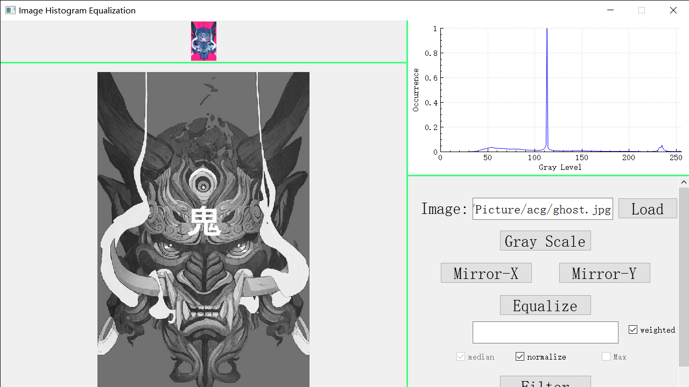
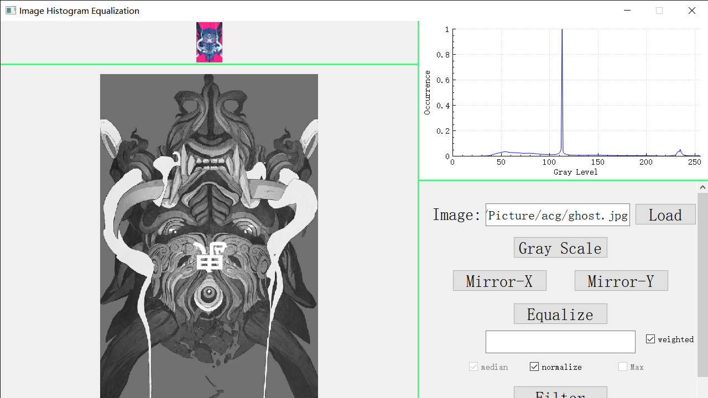
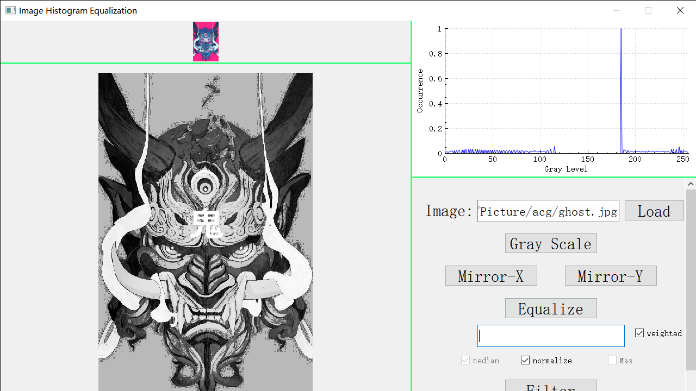
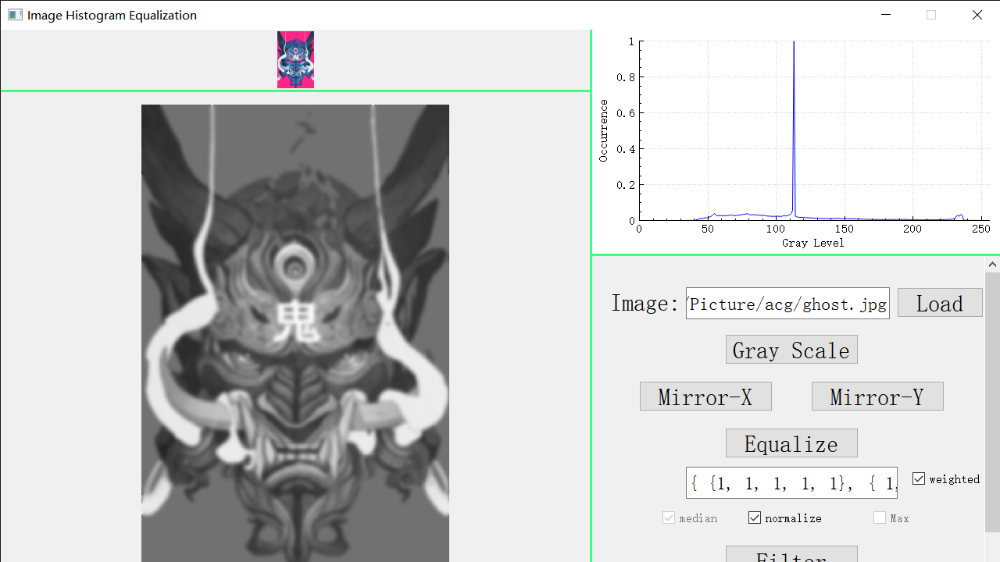
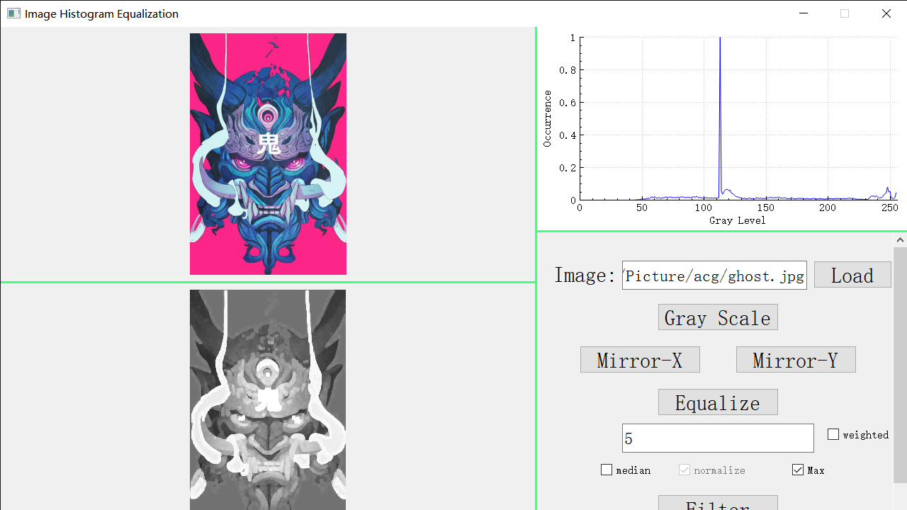
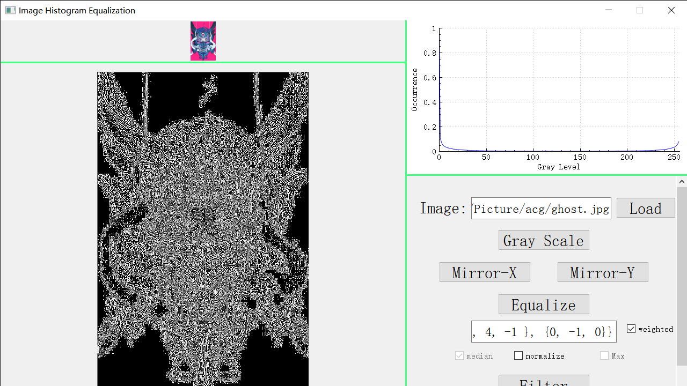

# ImageHistogramEqualization
Import an image, then perform grayscale and finally equalize its histogram
 
Test on Windows10, but not rely on it in theory 
Compiled on MinGw 7.3.0 64-bit 
Require C++11 and Qt 5.4 later 

# Note
1.The core algorithms for image processing is in *ImageDealer.h/cpp*, other files are used to interact with GUI(Qt). 
2.*stb_image* is used to decode the image into an consecutive array of pixels(or raw data). *ImageDealer.h/cpp* only knows the pixel array, not any class in Qt. 
3.*qcustomplot* is a plugin for plotting curve. If there is any issue with its DLL, please recompile its source in folder **qcustomplot-source** 

# Showcase

